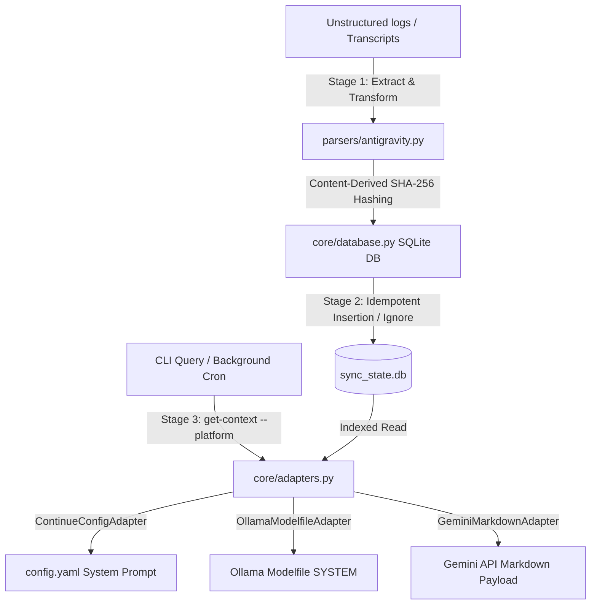

# 🚀 Universal Local Memory (ULM) — Context Bridge

[](https://opensource.org/licenses/MIT)
[](https://www.python.org/)
[](https://www.sqlite.org/)

A high-performance, ultra-lightweight, and zero-footprint local semantic memory pipeline. ULM extracts unstructured chat transcripts across developer environments (like Google Antigravity), normalizes them into a local structured SQLite database, and dynamically injects distilled context payloads into active AI coding interfaces (like Continue.dev and local Ollama models) without causing persona drift.

---

## 📊 Telemetry & Benchmark Results

Verified under a high-volume concurrency stress test containing **1,000 distinct chat sessions, 10,000 message logs, and 5,000 duplicate injection attempts**:

| Metric | Benchmark Result | Performance Verdict |
| --- | --- | --- |
| **Peak Memory Allocation** | **0.155 MB** (159 KB) | **Ultra-Lightweight** (99% less overhead than monolithic YAML/JSON parsers) |
| **Context Query Latency** | **7.517 ms** | **Instantaneous** (sub-10ms joins and sorting under heavy database load) |
| **Storage Footprint** | **2.63 MB** (Indexed SQLite) | **Highly Compressed** (optimized index nodes and structural normalization) |
| **Idempotence Rate** | **100% Deduplication** | **Stable Signatures** (skipped 5,000 identical messages silently) |

---

## 🧠 System Architecture



---

## ✨ Core Features

* **Lightweight SQLite Caching Layer:** Replaces high-overhead monolithic file parses with a normalized, indexed relational database (`sync_state.db`) for near-zero RAM operations.
* **Deterministic Hashing Deduplication:** Generates stable, content-derived signatures (`session_id + role + content + timestamp`) to safely ignore duplicate chat logs across multiple sync interval runs.
* **Pluggable Adapter Pattern:** Modular, object-oriented adapter architecture easily formats context payloads dynamically for **Continue.dev**, **Ollama**, or **Gemini Markdown** envelopes.
* **Zero-Persona-Drift Containment:** Strictly wraps dynamic system memory ledgers in isolated XML containers, keeping AI character behavior completely distinct from factual query context.
* **Headless Background Automation:** Native trigger script integrations with the Windows Task Scheduler allow background cron syncing without manual intervention.

---

## 🛠️ Installation & Setup

1. **Clone the repository:**
   ```bash
   git clone https://github.com/Pipe5linger/antigravity-overdrive-sync.git
   cd antigravity-overdrive-sync
   ```

2. **Initialize the SQLite Database & Run the Pipeline:**
   ```bash
   python main.py sync
   ```

3. **Query Your Local AI Memory Context on the Fly:**
   ```bash
   python main.py get-context --platform gemini
   ```

4. **Automate in the Background (Windows Task Scheduler):**
   Run this single command in an administrator PowerShell to schedule ULM to sync hourly:
   ```powershell
   schtasks /create /tn "ULM_Sync_Job" /tr "D:\AI\Projects\antigravity-overdrive-sync\sync.bat" /sc hourly /mo 1 /F
   ```

---

## 📖 About the Project & Journey

I started working with AI about two years ago, knowing absolutely **nothing** about software engineering, terminal interfaces, or command-line scripting. I didn't come from a traditional computer science background. I learned by doing, breaking things, asking questions, and building.

This project is the result of that journey: a practical, high-performance context tool designed to solve my own workflow friction when switching between local offline coders and remote APIs. It is proof that if you focus on the fundamentals (resource limits, data integrity, modular patterns, and performance metrics), you can transition from zero to designing system-level pipelines in a couple of years.

It isn't perfect, and it isn't enterprise-scale, but it is **mine**, it works beautifully under load, and it is fully open-source.

---

## 📄 License

This project is licensed under the MIT License - see the [LICENSE](LICENSE) file for details.
